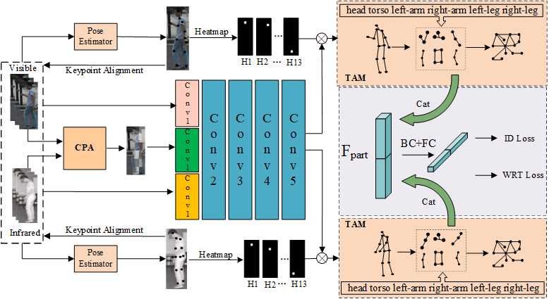
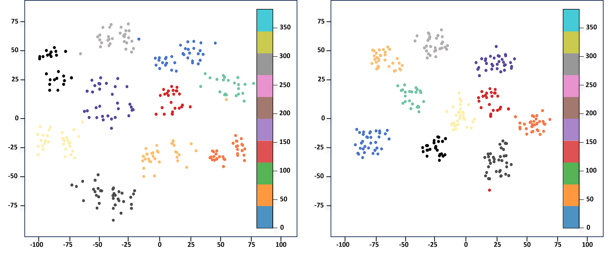

# CPA-TAM for Visible-Infrared Person Re-Identification

### Abstract
Visible-infrared person re-identification (VI-ReID) aims to match pedestrian images across RGB and infrared modalities. This task inherently suffers from modality discrepancy, pose variation, and occlusion due to heterogeneous sensing conditions and unconstrained environments, resulting in severe feature misalignment. Existing methods primarily address these challenges through alignment or pose guidance, but often neglect the structural and semantic dependencies among body regions. To this end, we propose CPA-TAM, a framework that partitions images into aggregated patches and fuses semantically consistent patch pairs via a tunable linear weighting strategy, generating intermediate representations that narrow the modality gap. In addition, a topology-guided region partitioning strategy and a dependency-enhanced mechanism are introduced to capture semantic relationships and improve discriminative learning. Owing to extensive patch-level modeling, our method benefits significantly from high-performance computing for large-scale training and inference. Experiments on SYSU-MM01 and RegDB demonstrate that CPA-TAM outperforms state-of-the-art methods, achieving Rank-1/mAP scores of 76.12%/71.94% and 94.48%/88.5%, respectively.

### DataSet

### Visualization

